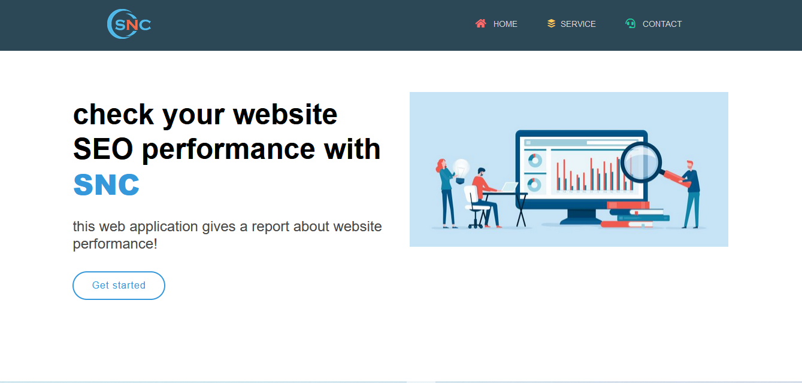
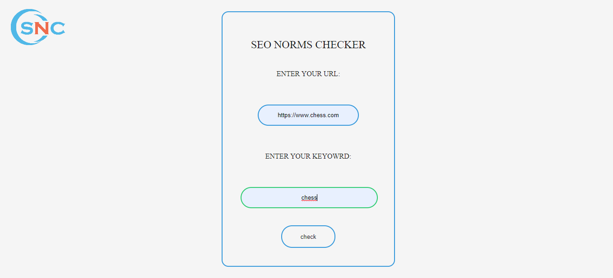
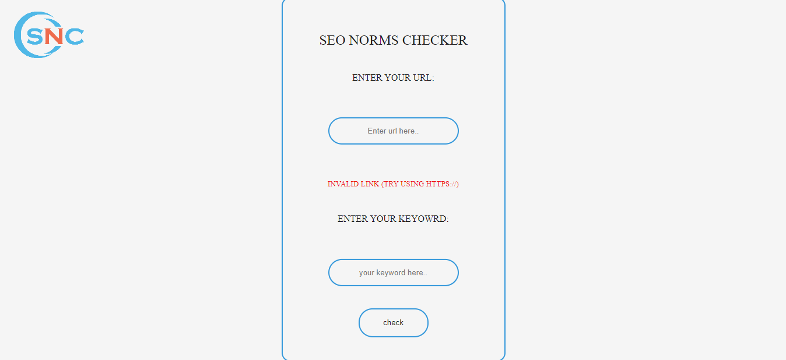
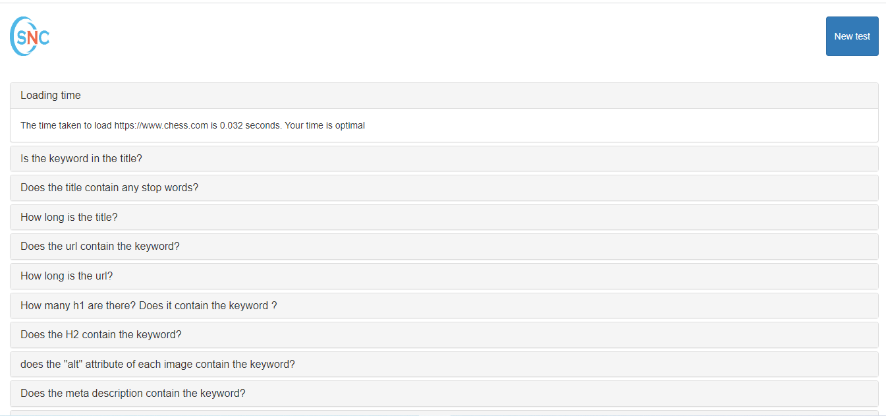

# SNC

# Description
this project was created to build a web application  checking the Search Engine Optimisation of any website using Python and flask


## Summary

- [SNC](#SNC)
  - [Summary](#Summary)
  - [Project Map](#project-map)
  - [requirements](#Requirements)
  - [Elements](#elements)
      - [home](#home)
      - [Form page](#)
      - [Invalid link](#invalid-link)
      - [Results](#results)

## Project Map

```
- SEOApp/                     … 
    -app.py/                    … The python file that we'll run
    -main.py/                    … rhis python file contains all the functions we need in our porject
    -templates/                    … all html
    -static/                    … all css files + images
```
## Requirements

### Anaconda

Anaconda is a distribution of the Python and R programming languages for scientific computing (data science, machine learning applications, large-scale data processing, predictive analytics, etc.), that aims to simplify package management and deployment.


Next open Anaconda Prompt, create a new virtual environnement and install the necessary libraries:

    ```bash
    conda create -n myenv python=3.7
    git fetch upstream
    pip install flask
    pip install bs4
    ```
## Elements

---

#### Home

this is the home page of our webapp



#### Form page

this is the page where we have to put the link of the website that will be analysed along with its main keyword



#### Invalid link

this page shows up in case the link provided is not valid



#### Results

this is the page where the results of the website SEO analysis are shown



## Version

les versions des technologies dans ce projet

| Technologie Name | Version |
| :--------------- | :-----: |
| python            | 3.7  |
| flask          | 1.1.2  |
| bs4              | 4.9.3 |


